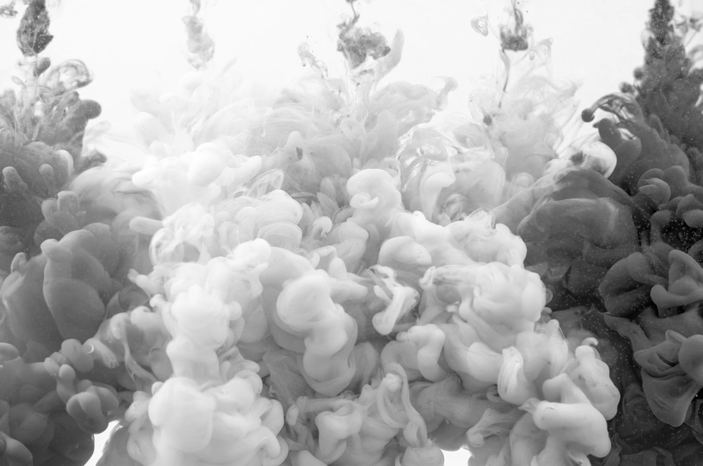

## Image Processing 

### Requirements
- python3
### Libraries
- opencv-python
- numpy
- matplotlib

### Setup
```
[Recommended] Create a python virtual environment
python -m venv env

[Required] Install requirements 
pip install -r requirements.txt
```

### Commands
run `process.py` with the following options

```
[Required] Image path (ex: assets/images/nature1.jfif)
--image path-to-image 
[Optional] Show image gradients (options: laplacian, sobelx, sobely, sobelxy, canny)
--gradient gradient_option
[Optional] Convert image color space (options: gray, hsv, lab, rgb)
--space color_space_option
[Optional] Resize the output image (original is 1.0)
--scale factor_value
```
### Sample Outputs
#### Gradient

`process.py --image assets/images/nature3.jfif --gradient canny`

Original             |  Canny
:-------------------------:|:-------------------------:
|

#### Color Space

`process.py --image assets/images/nature5.jfif --space hsv`

Original             |  HSV
:-------------------------:|:-------------------------:
|

#### Color Mapping Intensity 

```
# Lighter regions mean higher intensities of the pixel value and vice versa

process.py --image assets/images/nature2.jfif --channel red
process.py --image assets/images/nature2.jfif --channel blue
process.py --image assets/images/nature2.jfif --channel green

```

Original             |  Red pixel intensity
:-------------------------:|:-------------------------:
|
Green pixel intensity             |  Blue pixel intensity
|

#### Color Mapping Histogram
```
# maps the intensity values of the color pixels for blue, green, red
process.py --image assets/images/nature2.jfif --histogram color
```

Image             |  Image Histogram
:-------------------------:|:-------------------------:
|


### References
- [Jason Dsouza OpenCV tutorial](https://www.youtube.com/watch?v=oXlwWbU8l2o&t=10147s)
- [Murtaza's Workshop OpenCV tutorial](https://www.youtube.com/watch?v=WQeoO7MI0Bs)
- [OpenCV Python tutorial for Image Processing](https://opencv-python-tutroals.readthedocs.io/en/latest/py_tutorials/py_imgproc/py_table_of_contents_imgproc/py_table_of_contents_imgproc.html#py-table-of-content-imgproc)
